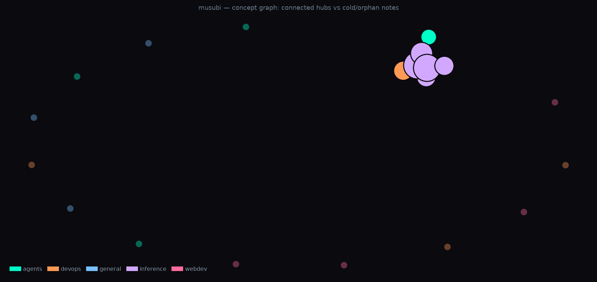

# Musubi 結び

**讓你的筆記學會旁徵博引。**

為 Markdown 筆記打造的確定性知識圖譜 — 不燒 LLM token、不綁定平台、不需要 server。

> [English](README.md) | 繁體中文

<p align="center">
  
</p>

```bash
$ musubi neighbors "vllm"

◇ [inference] Ollama vs vLLM: Same Model, 30% Speed Gap on GPU
  id=12  degree=5  concepts=15

  · w=7   [inference] Quantization Format Cheat Sheet: FP8, NVFP4, GGUF, AWQ, GPTQ
      shared: gotcha, gpu, vllm, inference
  · w=5   [devops] Docker GPU OOM: Why Your Container Crashes After 2 Hours
      shared: gpu, vram, vllm, inference
```

六週前你寫了一篇 FP8 KV cache 的 debug 筆記。今天你在處理另一個量化問題。
Keyword search 找不到那篇筆記，因為用的字完全不同。
Musubi 透過共享概念 — `quantization`、`kv cache`、`vllm` — 把它們連起來，
讓關聯自動浮現。

**古人說的旁徵博引，就是這件事 — 只是引的不是書，是你自己寫過的幾百篇筆記。**

---

## 它做什麼

Musubi 掃描一個資料夾裡的 Markdown 檔案，從每篇文件中提取技術概念，
建立一張加權的概念共現圖。結果是一個 JSON 圖譜，可以從命令列即時查詢：

| 指令 | 你會得到什麼 |
|------|------------|
| `musubi init` | 互動式設定 — 試玩 demo 或指向你的筆記 |
| `musubi build --source <dir>` | 從筆記資料夾建立圖譜 |
| `musubi stats` | 知識圖譜有多大？hub 節點是誰？ |
| `musubi neighbors <doc>` | 哪些筆記跟這篇相關？ |
| `musubi cold` | 哪些筆記已經冷掉、失去連結？ |
| `musubi search <query>` | 搜尋 + 顯示圖譜擴展的鄰居 |
| `musubi benchmark` | 測量 musubi 幫你省了多少 token |

不需要 server。不需要資料庫。不需要 API key。只需要 Markdown 檔案和一個 CLI。

---

## 為什麼不用其他工具？

| 工具 | 它做什麼 | 和 Musubi 的差異 |
|------|---------|-------------|
| **Obsidian Graph View** | `[[wikilinks]]` 視覺化圖 | 綁定 Obsidian。邊是手動建的（你自己寫連結）。沒有概念提取、沒有冷節點偵測、沒有 CLI。Musubi 對任何 Markdown 檔案都能用。 |
| **LightRAG** | LLM 驅動的 entity extraction → 知識圖譜 → RAG | 每次 build 都要燒 LLM token（$$）。需要架 server。為 RAG pipeline 設計，不是個人筆記管理。Musubi 的 build 是確定性的、免費的，24 秒完成。 |
| **Logseq / Roam** | 雙向連結的圖形化筆記 app | 專有格式。手動連結。沒有自動概念發現。Musubi 直接讀你現有的 `.md` 檔案，不用改格式。 |
| **Neo4j + scripts** | 完整的圖形資料庫 | 需要跑 Neo4j server。對個人筆記來說太重。Musubi 一個 `pip install` 搞定 — 圖譜就是一個 JSON 檔案。 |
| **純 vector search** | 用 embedding 距離找相似文件 | 相似 ≠ 相關。兩個 Python 檔案很「相似」（都是程式碼）但沒有知識上的關聯。概念共現捕捉的是**主題**關係，不是表面文字相似度。 |

**Musubi 的定位：** 它是**同伴**，不是替代品。你的 Markdown 檔案留在原地不動。
圖譜是純粹的衍生物 — 隨時可以刪掉重建。零綁定。

---

## 數據

內含的 demo 筆記（20 篇，5 個領域）瞬間完成。
400+ 篇的真實語料庫在 30 秒內 build 完：

| 指標 | Demo (20 篇) | 正式環境 (400 篇) |
|------|-------------|-----------------|
| 概念邊數 | 17 | 13,915 |
| 孤立節點 | 7 (35%) | 0 (0%) |
| Build 時間 | 0.7 秒 | 24 秒 |
| 圖譜檔案大小 | 8 KB | 1 MB |
| 讀取查詢速度 | < 100ms | < 200ms |

Demo 的 35% 孤立率在正式環境降到 0%，因為更大的語料庫有更多概念重疊 —
而且 qmd 模式有 embedding fallback 兜底。

預設概念字典包含 180+ 個通用技術詞彙。你可以用純文字檔案加入自己的領域詞彙
（見[自訂概念](#自訂概念)）。

---

## 安裝

需要 **Python 3.11+**。不需要其他外部工具。

**一行搞定**（如果你有 [uv](https://docs.astral.sh/uv/)）：

```bash
uvx --from git+https://github.com/coolthor/musubi musubi init
```

下載、安裝、啟動設定精靈，一行完成。

**或永久安裝：**

```bash
git clone https://github.com/coolthor/musubi.git
cd musubi
uv tool install .           # 或者: pip install .

musubi init                 # 互動式設定精靈
```

設定精靈會檢查環境、讓你試玩內建的 demo 或指向自己的筆記、
引導你設定自訂概念 — 全程不到一分鐘。

---

## 快速開始

```bash
# 從 Markdown 資料夾建立圖譜
musubi build --source ~/my-notes/

# 探索
musubi stats                         # 圖譜概覽
musubi neighbors "some-doc-slug"     # 這篇連到什麼？
musubi cold --limit 20               # 什麼冷掉了？
```

### 範例輸出：`musubi neighbors`

```
◇ [inference] Ollama vs vLLM: Same Model, 30% Speed Gap on GPU
  id=12  degree=5  concepts=15

  · w=7   [inference] Quantization Format Cheat Sheet: FP8, NVFP4, GGUF, AWQ, GPTQ
      shared: gotcha, gpu, vllm, inference
  · w=5   [devops] Docker GPU OOM: Why Your Container Crashes After 2 Hours
      shared: gpu, vram, vllm, inference
```

注意 **Docker GPU OOM**（一篇 devops 筆記）出現在一篇 benchmark 筆記的鄰居裡 —
它們共享 `gpu`、`vram`、`vllm` 和 `inference`。
Keyword search 搜 "benchmark" 永遠不會回傳一篇 devops debug 筆記。

**這就是旁徵博引 — 跨領域的關聯自動浮現，不需要你記得每篇筆記寫過什麼。**

---

## 運作原理

```
                    musubi build
                         │
          ┌──────────────┼──────────────┐
          ▼              ▼              ▼
   ┌────────────┐ ┌────────────┐ ┌────────────┐
   │ ~/notes/   │ │ qmd sqlite │ │ concepts   │
   │ *.md 檔案  │ │ (可選)     │ │ 概念字典   │
   └─────┬──────┘ └─────┬──────┘ └─────┬──────┘
         │              │              │
         └──────────────┼──────────────┘
                        ▼
              ┌──────────────────┐
              │ 概念提取          │  用 regex 比對
              │ 逐篇掃描         │  180+ 內建詞彙
              └────────┬─────────┘  + 你的自訂詞彙
                       ▼
              ┌──────────────────┐
              │ 共現邊建立        │  如果文件 A 和文件 B
              │ IDF 加權         │  都提到 "vllm" + "kv cache"
              │                  │  → edge(A,B, weight=IDF)
              └────────┬─────────┘
                       ▼
              ┌──────────────────┐
              │ graph.json       │  NetworkX node_link_data
              │ (~1 MB)          │  自動偵測過期、自動重建
              └──────────────────┘
```

### 關鍵設計決策

- **概念提取是確定性的。** Build 過程沒有 LLM。同樣的輸入 → 永遠同樣的圖譜。
  不花 API 錢、不會幻覺出不存在的 entity、不受 rate limit。
- **讀取路徑不 import 重量級套件。** `musubi stats` 和 `musubi neighbors` 只載入
  JSON 檔案，從記憶體回答。沒有 networkx、沒有 numpy。冷啟動極快。
- **邊是可解釋的。** 每條邊帶著 `shared_concepts` 清單 — 你永遠看得到**為什麼**
  兩篇文件被連在一起，不只是「它們相關」。
- **IDF 加權。** 稀有概念（只出現在少數文件）的邊權重更高。
  「api」出現在 43% 的文件裡 → 幾乎不算分。
  「kv cache」只出現在 1% → 高分。這避免了「什麼都跟什麼都連」的毛球問題。

---

## 保持圖譜新鮮

Musubi 偵測到過期時會自動重建 — **不需要 cron、不需要手動 rebuild。**

每次查詢時，musubi 檢查三個條件：

1. **圖譜年齡** — 超過 24 小時？
2. **來源索引** — qmd sqlite 在上次 build 後有更新？
3. **監控目錄** — `MUSUBI_WATCH_DIRS` 裡有比圖譜更新的 `.md`？

任何一個條件為真，就在回傳結果前自動重建：

```
$ musubi neighbors "vllm"
  ↻ graph is stale (3d old), auto-rebuilding...
  ✓ rebuilt: 402 docs, 16596 edges

◇ [ai-muninn] dgx-spark-nemotron-120b-vllm
  ...
```

### 監控額外目錄

設定 `MUSUBI_WATCH_DIRS` 來監控 qmd 索引以外的目錄 — 例如 AI 助手寫筆記的
auto-memory 目錄：

```bash
# 在 ~/.zshrc 或 ~/.bashrc
export MUSUBI_WATCH_DIRS="$HOME/.claude/memory:$HOME/extra-notes"
```

冒號分隔，跟 `$PATH` 一樣。任何目錄裡比圖譜更新的 `.md` 檔案都會在下次查詢時
觸發重建。

---

## 自訂概念

預設字典涵蓋通用技術詞彙。用純文字檔案加入你自己的領域詞彙：

```bash
# ~/.config/musubi/concepts.txt
# 一行一個詞。# 開頭是註解。

# 產品名稱
my-internal-tool

# 領域詞彙（例如金融）
bull put spread
delta hedging
iv rank

# 硬體
dgx spark
gb10
```

然後重建：`musubi build --source ~/notes/`

預設 + 自訂概念在 build 時合併。你的自訂檔案永遠不會被 commit 到 musubi repo。

---

## 搭配 Claude Code 使用

兩種整合層級 — 選適合你的：

### 方法 A：自動 Hook（推薦）

加一個 [PreToolUse hook](https://docs.anthropic.com/en/docs/claude-code/hooks)，
在**每次 web 搜尋前自動跑 `musubi search`**。Claude 在搜尋網路之前先看到你的
內部知識 — 不可能忘記。

**1. 儲存 hook script：**

```bash
mkdir -p ~/.claude/hooks

cat > ~/.claude/hooks/musubi-presearch.sh << 'HOOKEOF'
#!/bin/bash
MUSUBI=$(command -v musubi 2>/dev/null)
[ -z "$MUSUBI" ] && exit 0
[ ! -f "$HOME/.local/share/musubi/graph.json" ] && exit 0

QUERY=$(echo "$TOOL_INPUT" | python3 -c "
import sys, json
try:
    d = json.load(sys.stdin)
    print(d.get('query', ''))
except:
    pass
" 2>/dev/null)
[ -z "$QUERY" ] && exit 0

RESULT=$("$MUSUBI" search "$QUERY" --limit 3 2>/dev/null)
if [ -n "$RESULT" ] && ! echo "$RESULT" | grep -q "No results\|not found"; then
    echo "🔗 musubi (internal knowledge):"
    echo "$RESULT"
fi
HOOKEOF

chmod +x ~/.claude/hooks/musubi-presearch.sh
```

**2. 加到 `~/.claude/settings.json`**（`hooks.PreToolUse` 裡面）：

```json
{
  "matcher": "WebSearch",
  "hooks": [{
    "type": "command",
    "command": "bash ~/.claude/hooks/musubi-presearch.sh",
    "statusMessage": "checking internal knowledge..."
  }]
}
```

現在每次 WebSearch 都會先顯示 `🔗 musubi` 區塊 — Claude 在搜尋網路之前
自動知道你已經有什麼。

### 方法 B：CLAUDE.md 指令（簡單版）

如果不想設 hook，在你的 `CLAUDE.md` 加這段：

```markdown
### 知識檢索流程

1. 搜尋網路之前，先查內部知識：
   `musubi search "<topic>"` — 顯示 keyword 命中 + 圖譜鄰居
2. 找到相關文件後，擴展 context：
   `musubi neighbors "<filename>" --limit 3`
3. 只搜尋外部真正新的東西。
```

### 不需要 MCP server

兩種方法都透過 shell 運作。Claude Code 呼叫 `musubi` 跟呼叫 `grep` 或 `git`
一樣。不需要 server process，不需要額外配置。

---

## 測量 token 節省

Musubi 自己用**零 LLM token** — 圖譜用確定性的 regex 比對建立，不用 LLM
做 entity extraction。但用 musubi 輔助 LLM 搜尋筆記，能不能省 token？

內建的 benchmark 用實驗回答這個問題：

```bash
# 預覽 10 個測試任務（不呼叫 API，零成本）
musubi benchmark --dry-run

# 完整測試 — 比較純 grep vs musubi 輔助的檢索
# 需要 ANTHROPIC_API_KEY。成本：每次約 $0.15。
export ANTHROPIC_API_KEY=sk-ant-...
musubi benchmark
```

### 為什麼用測試而不是宣稱

我們不會在 README 裡寫「省 40% token」但沒有數據。自己跑 benchmark 看你的
實際數字。實驗用內建的 demo 筆記（20 篇），結果可重現 — 任何 clone repo 的人
都會得到一樣的測試結果。

---

## 先前技術

- [LightRAG](https://github.com/HKUDS/LightRAG) — LLM 驅動的知識圖譜 + RAG。
  Musubi 借用「把筆記當圖譜處理」的概念，但用確定性的概念比對取代 LLM extraction。
- [Obsidian graph view](https://help.obsidian.md/Plugins/Graph+view) —
  視覺直覺的來源。Musubi 用 CLI 工具在純 Markdown 檔案上實現相同的結構。
- Louvain community detection、betweenness centrality — `musubi cold` 和
  社群識別背後的圖論基礎。

---

## 授權

MIT。見 [LICENSE](LICENSE)。
